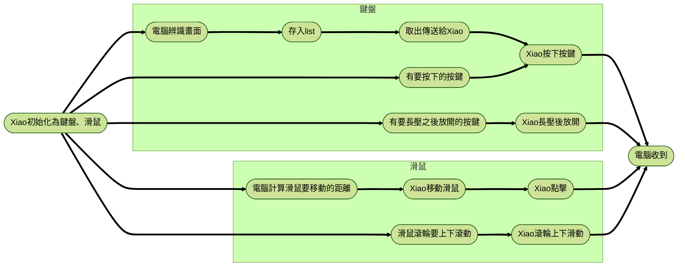

# MapleScript
一個基於視覺辨識、Seeed Studio Xiao ESP32S3、CircuitPython的腳本程式。

主要目的是打造**有耳朵的鍵盤、滑鼠**，能夠一邊聽，一邊按下按鍵或是一邊移動滑鼠

## 整體流程

### 視覺辨識
視覺辨識採用Pyautogui：先將要辨識的區域截圖，並將要比對的圖片用Pillow吃進記憶體以減少IO開銷，最後於截圖上進行比對

有比對到想要的東西，就再進行按下對應的按鍵，或是將滑鼠移動過去的操作

### 與CircuitPython的溝通
硬體採用**Seeed Studio Xiao ESP32S3**，刷入CircuitPython，並且初始化為鍵盤、滑鼠之後持續聆聽USB送過來的訊號

### TODO:
- 看一下為什麼不能用`usb_cdc.data`溝通
  - 找到問題點了，似乎這塊Seeed Studio Xiao ESP32S3在CircuitPython 9.2.8中無法同時在boot.py裡面啟用`console=True`和`data=True`，只能擇一。 
  - 所以要馬用console，要馬就用data，我們為了聽到Xiao回傳的訊息，所以還是選用console。
- 其他動作可能要繼承MapleScript class 之後來操作
  - 已經實作：
    - 開始 / 完成每日任務
    - 怪物蒐藏
    - 領取戰地硬幣
    - 自動分解裝備
    - 拍賣領/重新上架東西
    - 領取HD
    - 領取里程
    - 完成師徒
    - 小屋每日對話
    - 打開倉庫輸入第二組密碼

