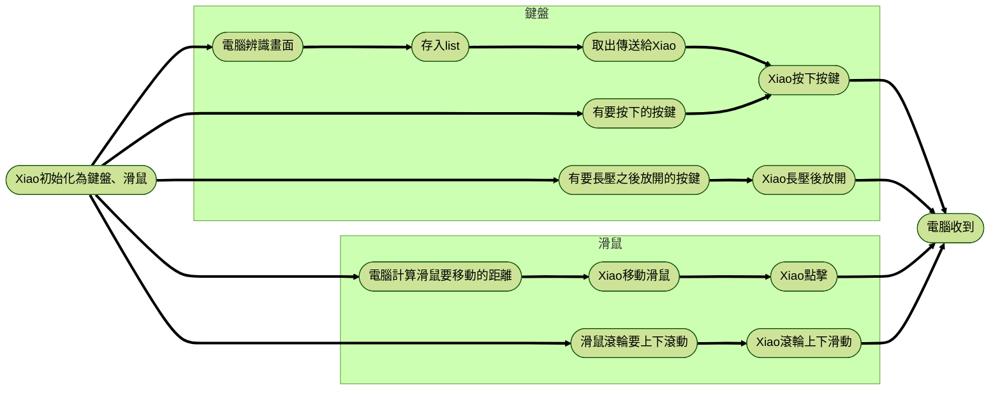

# MapleScript
一個基於視覺辨識、Seeed Studio Xiao ESP32S3、CircuitPython 的自動化腳本程式。
現在已升級為具備 **圖形化控制中心 (GUI)** 的完整應用程式，提供更直覺的操作與更高的安全性。

主要目的是打造**有耳朵的鍵盤、滑鼠**，能夠一邊聽（辨識畫面），一邊按下按鍵或是一邊移動滑鼠。

## ✨ 主要特色
- **現代化控制中心**：基於 PySide6 的深色主題介面，操作直覺。
- **安全掛機**：具備**緊急停止 (Emergency Stop)** 機制，可隨時中斷當前腳本。
- **即時回報**：GUI 介面即時顯示執行日誌 (Log)，清楚掌握腳本進度。
- **全自動化功能**：
  - **自動練功 (Auto Grind)**：依據小地圖判斷位置並執行巡邏路徑。
  - **每日任務全自動**：每日任務、每週任務、戰地硬幣、HD 獎勵、里程領取。
  - **Boss 挑戰**：自動挑戰每日 Boss (如：炎魔、暴君、希拉、阿卡伊農等)。
  - **其他輔助**：怪物蒐藏、自動分解裝備、拍賣場管理、倉庫密碼輸入、跳舞機活動。

## 🛠️ 環境需求與安裝

1.  **硬體準備**：
    - 需要一塊 **能刷入 CircuitPython** 的開發板 (推薦 Seeed Studio Xiao ESP32S3)。
    - 將 `XiaoCode/` 資料夾內的程式碼燒錄至開發板。
2.  **軟體安裝**：
    - 安裝 Python 3.10+。
    - 安裝相依套件：
      ```bash
      pip install -r requirements.txt
      ```
    - 設定 `config/config.yaml` (技能按鍵、圖片路徑) 與 `.env` (敏感資料)。

## 🚀 使用方式

### 方式一：圖形化控制中心 (推薦)
這是最簡單的使用方式，啟動後會出現視窗介面。
```bash
python main.py
```
- 點擊左側按鈕啟動對應任務。
- 點擊紅色 **「🔴 緊急停止」** 按鈕可立即中斷腳本。
- 右側面板會顯示執行紀錄。

### 方式二：指令模式 (CLI)
適合開發者除錯或習慣使用終端機的用戶。
```bash
python -m src <任務指令>
```
| 功能 | 指令 | 說明 |
| :--- | :--- |:---|
| **自動練功** | `python -m src grind` | 執行自動打怪腳本 |
| **每日任務** | `python -m src daily` | 執行每日例行事項 |
| **每日 Boss** | `python -m src daily_boss` | 自動挑戰每日 Boss |
| **怪物蒐藏** | `python -m src collection` | 領取怪物蒐藏 |
| **倉庫存取** | `python -m src storage` | 自動輸入倉庫密碼 |
| **跳舞機** | `python -m src dance` | 執行跳舞機活動腳本 |

## 🏗️ 軟體架構流程

現在的架構採用 **多執行緒 (Multi-threading)** 設計，確保介面流暢且操作安全。

```mermaid
graph TD
    User((使用者)) -->|點擊按鈕| GUI[圖形介面 (PySide6)]
    
    subgraph "前端 (Main Thread)"
        GUI -->|啟動任務| TaskManager[任務管家]
        GUI -->|按下停止| TaskManager
        LogSignal[Log 信號橋樑] -.->|更新文字| GUI
    end

    subgraph "後端 (Worker Thread)"
        TaskManager -->|產生獨立執行緒| Worker[工作執行緒]
        Worker -->|執行邏輯| Script[MapleScript (練功/打王...)]
        
        Script -->|回報進度| LogSignal
        Script -->|檢查停止信號| StopEvent{是否停止?}
        
        Script -->|視覺辨識| Vision[電腦視覺 (OpenCV)]
        Script -->|控制指令| Controller[Xiao 控制器]
    end

    subgraph "硬體層"
        Controller ==>|USB Serial| XiaoBoard[Xiao ESP32S3]
        XiaoBoard ==>|HID| Game[楓之谷視窗]
    end
```

## 🔌 硬體互動原理
