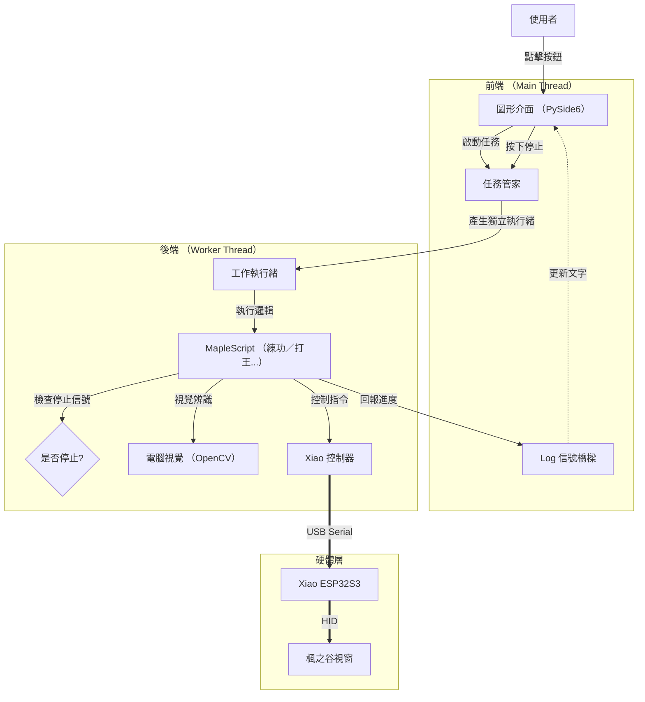

# MapleScript
一個基於視覺辨識、Seeed Studio Xiao ESP32S3、CircuitPython、GUI 的自動化腳本程式，提供直覺的操作、路徑錄製功能。

主要目的是打造**有耳朵的鍵盤、滑鼠**，能夠一邊聽（辨識畫面），一邊按下按鍵或是一邊移動滑鼠。

## ✨ 主要特色
- **現代化控制中心**：基於 PySide6 的深色主題介面。
- **路徑錄製與重播**：支援手動錄製練功循環路徑，並實現高精度的時間序列重播。
- **安全防護機制**：
  - **自動偵測暫停**：偵測到符文 (Rune) 或其他玩家 (紅點) 時自動暫停。
  - **緊急停止 (STOP)**：一鍵即時中斷所有背景任務。
- **全自動化功能**：
  - **自動練功 (Auto Grind)**：支援「定點模式」與「路徑循環模式」，自動辨識並施放冷卻完畢的技能。
  - **每日行程全自動**：自動處理每日/每週任務、戰地硬幣、HD 獎勵、里程、拍賣場、師徒與小屋。
  - **輔助工具**：怪物蒐藏、裝備分解、倉庫密碼自動輸入。

## 🛠️ 環境需求與安裝

1.  **硬體準備**：
    - 需要一塊 **能刷入 CircuitPython** 的開發板。
    - 將 `code/` 資料夾內的程式碼燒錄至開發板。
2. **執行可執行檔（exe）**
3. **或是安裝Python和相依套件後本地運行**：
    - 安裝 Python 3.10+
    - 建立並啟動虛擬環境：
      ```bash
      python -m venv venv
      .\venv\Scripts\activate
      ```
    - 安裝相依套件：
      ```bash
      pip install -r requirements.txt
      ```
    - 啟動主程式：
      ```bash
      python main.py
      ```   
3.  **自動配置**：
    - 啟動程式後，透過各任務旁的 **⚙️ 設定按鈕** 即可完成技能按鍵、圖片擷取與路徑錄製。

## 🚀 使用方式

- **硬體連線**：系統會根據序號自動匹配開發板，若連線失敗將彈出診斷視窗引導設定。
- **任務執行**：在左側面板選擇任務點擊啟動，右側會顯示即時執行紀錄。
- **參數設定**：透過按鈕旁的齒輪圖示進入設定頁面。
- **安全中斷**：隨時點擊紅色 **「🔴 緊急停止」** 按鈕可立即停止腳本。

## 🏗️ 軟體架構流程

現在的架構採用 **多執行緒 （Multi-threading）** 設計，確保介面流暢且操作安全。



## 🔌 硬體互動原理


## 📄 License & Disclaimer

本專案採用 [GNU General Public License v3.0](LICENSE.txt) 授權。使用本軟體前，請務必閱讀並同意 `LICENSE.txt` 檔案中所列之**免責聲明**。