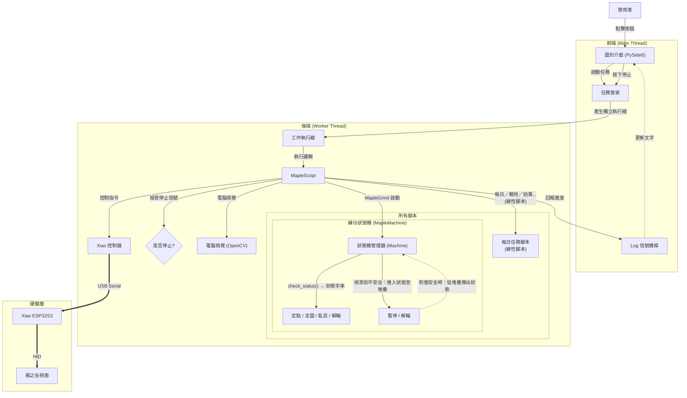
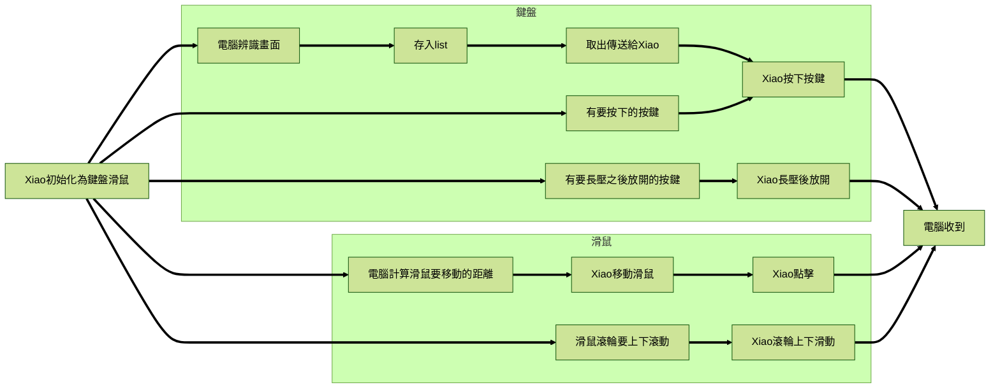

<h1 align="center">MapleScript</h1>

<p align="center">
  
  
  
</p>

<p align="center">
  <a href="README_EN.md">English</a> | <a href="README.md">繁體中文</a>
</p>


一個基於電腦視覺、Seeed Studio Xiao ESP32S3、CircuitPython 與 PySide6 GUI 的自動化腳本程式，提供直覺的操作與路徑錄製功能。

主要目的是打造**有耳朵的鍵盤、滑鼠**，能夠一邊聽（辨識畫面元件），一邊模擬按鍵或移動滑鼠。

## ✨ 主要特色
- **現代化控制中心**：深色主題的圖形介面。
- **路徑錄製與重播**：支援手動錄製練功循環路徑，並實現高精度的時間序列重播。
- **全自動化功能**：
  - **自動練功 (Auto Grind - 狀態機架構)**：
    - 採用 **Finite State Machine (FSM)** 設計，將練功行為拆分為獨立模組狀態：Stationary (定點)、Walker (走圖)、Wander (亂逛)、RuneSolver (解輪) 與 Pause (暫停)。
    - **堆疊中斷機制 (Stack-based Interrupt)**：當偵測到不安全狀況（如偵測到紅點、出現符文、失去視窗焦點）時，狀態機會將當前狀態推入堆疊並切換至中斷狀態；當環境恢復安全後，能自動彈出（Pop）並無縫恢復先前狀態 — **完整保留內部計時（如冷卻時間）**。
  - **每日行程全自動**：自動處理每日/每週任務、戰地硬幣、HD、里程、拍賣場、小屋等。
  - **輔助工具**：怪物蒐藏、裝備分解、倉庫密碼自動輸入。

## 🛠️ 環境需求與安裝

1.  **硬體準備**：
    - 請參考[如何準備硬體](how_to_circuitpython.md)
2. **執行可執行檔（exe）**
3. **或是安裝 Python 和相依套件後本地運行**：
    - 安裝 Python 3.11+
    - 建立並啟動虛擬環境：
      ```bash
      python -m venv venv
      .\venv\Scripts\activate
      ```
    - 安裝相依套件：
      ```bash
      pip install -r requirements.txt
      ```
    - 啟動主程式：
      ```bash
      python main.py
      ```   
4.  **自動配置**：
    - 啟動程式後，透過各任務旁的 **⚙️ 設定按鈕** 即可完成技能按鍵、圖片擷取與路徑錄製。

## 🏗️ 軟體架構流程

現在的架構採用 **多執行緒 （Multi-threading）** 設計，確保介面流暢且操作安全。


```mermaid
graph TD
    User[使用者] -->|點擊按鈕| GUI["圖形介面 (PySide6)"]

    subgraph "前端 (Main Thread)"
        GUI -->|啟動任務| TaskManager["任務管家"]
        GUI -->|按下停止| TaskManager
        LogSignal["Log 信號橋樑"] -.->|更新文字| GUI
    end

    subgraph "後端 (Worker Thread)"
        TaskManager -->|產生獨立執行緒| Worker["工作執行緒"]
        Worker -->|執行邏輯| Script["MapleScript"]

        subgraph "所有腳本"
            Daily["每日任務腳本\n(線性腳本)"]
            subgraph "練功狀態機 (MapleMachine)"
                FSM["狀態機管理器 (Machine)"]
                State["定點 / 走圖 / 亂逛 / 解輪"]
                PauseState["暫停 / 解輪"]
                FSM -->|"check_status() → 狀態字串"| State
                FSM -->|"偵測到不安全：推入狀態至堆疊"| PauseState
                PauseState -.->|"恢復安全時：從堆疊彈出狀態"| FSM
            end
        end

        Script -->|"每日／戰地／拍賣...\n(線性腳本)"| Daily
        Script -->|MapleGrind 啟動| FSM
        Script -->|回報進度| LogSignal
        Script -->|檢查停止信號| StopEvent{"是否停止?"}
        Script -->|電腦視覺| Vision["電腦視覺 (OpenCV)"]
        Script -->|控制指令| Controller["Xiao 控制器"]
    end

    subgraph "硬體層"
        Controller ==>|USB Serial| XiaoBoard["Xiao ESP32S3"]
        XiaoBoard ==>|HID| Game["楓之谷視窗"]
    end
```

> [!NOTE]
> 關於自動練功狀態機的詳細轉移邏輯、冷卻設計與堆疊暫停運作原理，請參考 [狀態機系統說明文件](src/states/README.md)。

## 🔌 硬體互動原理

```mermaid
%%{init: {'theme': 'forest'} }%%
graph LR;

step1[Xiao初始化為鍵盤滑鼠]

step2[電腦辨識畫面]

step3[存入list]

step4[取出傳送給Xiao]

step5[Xiao按下按鍵]

step6[電腦收到]

step7[Xiao移動滑鼠]

step8[電腦計算滑鼠要移動的距離]

step9[滑鼠滾輪要上下滾動]

step10[Xiao滾輪上下滑動]

step11[Xiao點擊]

step12[有要按下的按鍵]

step13[有要長壓之後放開的按鍵]

step14[Xiao長壓後放開]

%% 流程線 -->
step1 ==> step2
step1 ==> step8
step1 ==> step9
step1 ==> step12
step1 ==> step13
step5 ==> step6
step14 ==> step6
step11 ==> step6
step10 ==> step6

subgraph 鍵盤
step2 ==> step3 ==> step4 ==> step5
step12 ==> step5
step13 ==> step14
end
subgraph 滑鼠
step8 ==> step7 ==> step11
step9 ==> step10
end
```

## 📄 License & Disclaimer

本專案採用 [GNU General Public License v3.0](LICENSE.txt) 授權。使用本軟體前，請務必閱讀並同意 `LICENSE.txt` 檔案中所列之**免責聲明**。

## ⭐ Star History

[](https://www.star-history.com/#abc21086999/maple_script&type=date&legend=top-left)