# MapleScript
一個基於視覺辨識、Seeed Studio Xiao ESP32S3、CircuitPython、GUI 的自動化腳本程式，提供直覺的操作、路徑錄製功能。

主要目的是打造**有耳朵的鍵盤、滑鼠**，能夠一邊聽（辨識畫面），一邊按下按鍵或是一邊移動滑鼠。

## ✨ 主要特色
- **現代化控制中心**：基於 PySide6 的深色主題介面。
- **路徑錄製與重播**：支援手動錄製練功循環路徑，並實現高精度的時間序列重播。
- **安全防護機制**：
  - **自動偵測暫停**：偵測到符文 (Rune) 或其他玩家 (紅點) 時自動暫停。
  - **緊急停止 (STOP)**：一鍵即時中斷所有背景任務。
- **全自動化功能**：
  - **自動練功 (Auto Grind)**：支援「定點模式」與「路徑循環模式」，自動辨識並施放冷卻完畢的技能。
  - **每日行程全自動**：自動處理每日/每週任務、戰地硬幣、HD 獎勵、里程、拍賣場、師徒與小屋。
  - **輔助工具**：怪物蒐藏、裝備分解、倉庫密碼自動輸入。

## 🛠️ 環境需求與安裝

1.  **硬體準備**：
    - 需要一塊 **能刷入 CircuitPython** 的開發板。
    - 將 `code/` 資料夾內的程式碼燒錄至開發板。
2. **執行可執行檔（exe）**
3. **或是安裝Python和相依套件後本地運行**：
    - 安裝 Python 3.10+
    - 建立並啟動虛擬環境：
      ```bash
      python -m venv venv
      .\venv\Scripts\activate
      ```
    - 安裝相依套件：
      ```bash
      pip install -r requirements.txt
      ```
    - 啟動主程式：
      ```bash
      python main.py
      ```   
3.  **自動配置**：
    - 啟動程式後，透過各任務旁的 **⚙️ 設定按鈕** 即可完成技能按鍵、圖片擷取與路徑錄製。

## 🚀 使用方式

- **硬體連線**：系統會根據序號自動匹配開發板，若連線失敗將彈出診斷視窗引導設定。
- **任務執行**：在左側面板選擇任務點擊啟動，右側會顯示即時執行紀錄。
- **參數設定**：透過按鈕旁的齒輪圖示進入設定頁面。
- **安全中斷**：隨時點擊紅色 **「🔴 緊急停止」** 按鈕可立即停止腳本。

## 🏗️ 軟體架構流程

現在的架構採用 **多執行緒 （Multi-threading）** 設計，確保介面流暢且操作安全。

```mermaid
graph TD
    User[使用者] -->|點擊按鈕| GUI[圖形介面 （PySide6）]
    
    subgraph "前端 （Main Thread）"
        GUI -->|啟動任務| TaskManager[任務管家]
        GUI -->|按下停止| TaskManager
        LogSignal[Log 信號橋樑] -.->|更新文字| GUI
    end

    subgraph "後端 （Worker Thread）"
        TaskManager -->|產生獨立執行緒| Worker[工作執行緒]
        Worker -->|執行邏輯| Script[MapleScript （練功／打王...）]
        
        Script -->|回報進度| LogSignal
        Script -->|檢查停止信號| StopEvent{是否停止?}
        
        Script -->|視覺辨識| Vision[電腦視覺 （OpenCV）]
        Script -->|控制指令| Controller[Xiao 控制器]
    end

    subgraph "硬體層"
        Controller ==>|USB Serial| XiaoBoard[Xiao ESP32S3]
        XiaoBoard ==>|HID| Game[楓之谷視窗]
    end
```



## 🔌 硬體互動原理
```mermaid
%%{init: {'theme': 'forest'} }%%
graph LR;

step1[Xiao初始化為鍵盤、滑鼠]

step2[電腦辨識畫面]

step3[存入list]

step4[取出傳送給Xiao]

step5[Xiao按下按鍵]

step6[電腦收到]

step7[Xiao移動滑鼠]

step8[電腦計算滑鼠要移動的距離]

step9[滑鼠滾輪要上下滾動]

step10[Xiao滾輪上下滑動]

step11[Xiao點擊]

step12[有要按下的按鍵]

step13[有要長壓之後放開的按鍵]

step14[Xiao長壓後放開]

%% 流程線 -->
step1 ==> step2
step1 ==> step8
step1 ==> step9
step1 ==> step12
step1 ==> step13
step5 ==> step6
step14 ==> step6
step11 ==> step6
step10 ==> step6

subgraph 鍵盤
step2 ==> step3 ==> step4 ==> step5
step12 ==> step5
step13 ==> step14
end
subgraph 滑鼠
step8 ==> step7 ==> step11
step9 ==> step10
end
```