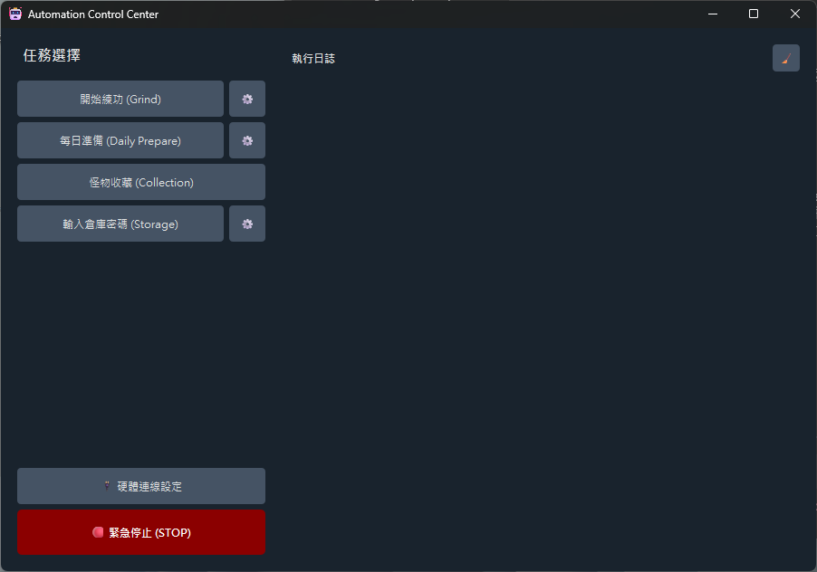
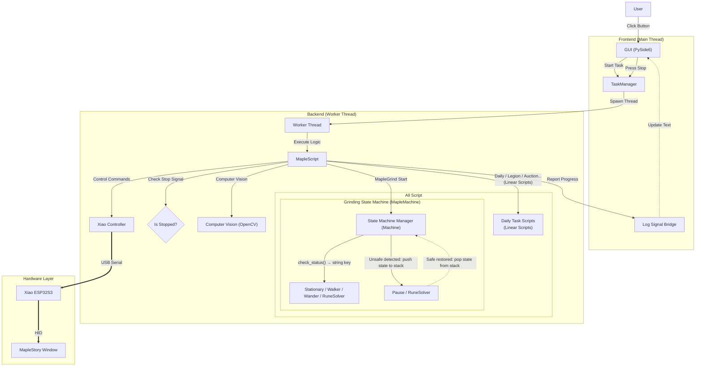
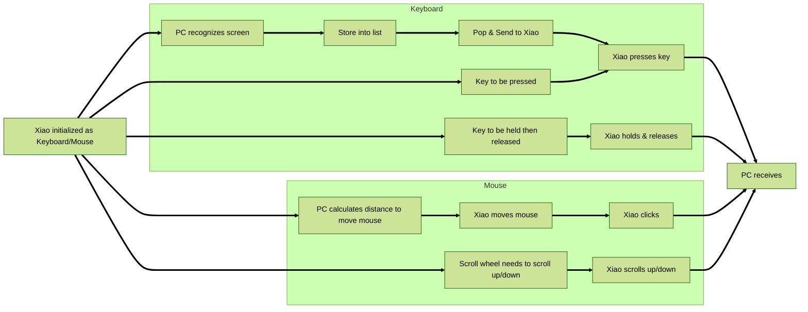

<h1 align="center">MapleScript</h1>

<p align="center">
  
  
  
</p>

<p align="center">
  <a href="README_EN.md">English</a> | <a href="README.md">繁體中文</a>
</p>



An automation script application based on computer vision, Seeed Studio Xiao ESP32S3, CircuitPython, and a PySide6 GUI, providing intuitive operations and route recording features.

The primary goal is to build a **keyboard and mouse with "ears"**, capable of matching screen elements (listening) while simulating keystrokes or mouse movements.

## ✨ Key Features
- **Modern Control Center**: A dark-themed GUI.
- **Route Recording & Replay**: Supports manual recording of grinding loops and replays them with high-precision time series.
- **Full Automation Functions**:
  - **Auto Grind (State Machine Architecture)**:
    - Designed with a **Finite State Machine (FSM)**, separating grinding behaviors into modular states: Stationary, Walker, Wander, RuneSolver, and Pause.
    - **Stack-based Interrupt**: When unsafe conditions are detected (e.g., player nearby, rune appears, focus lost), the Machine pushes the current state onto a stack and transitions to an interrupt state. Once the environment is safe, the Machine pops the previous state and resumes seamlessly — preserving internal state such as remaining cooldown time.
  - **Daily Automations**: Automatically processes daily/weekly quests, Legion coins, Fairy Bros' Daily Gift (HD), Maple Points (Milestone), Auction House, Home, and more.
  - **Utility Tools**: Monster Collection, Gear Extraction, and automatic warehouse secondary password entry.

## 🛠️ Requirements & Installation

1. **Hardware Preparation**:
   - Please refer to [How to Prepare Hardware](how_to_circuitpython_EN.md)
2. **Run the Executable File (.exe)**
3. **Or Run Locally with Python**:
   - Install Python 3.11+
   - Create and activate a virtual environment:
     ```bash
     python -m venv venv
     .\venv\Scripts\activate
     ```
   - Install dependencies:
     ```bash
     pip install -r requirements.txt
     ```
   - Run the main script:
     ```bash
     python main.py
     ```
4. **Auto-Configuration**:
   - After launching, click the **⚙️ Settings button** next to each task to configure hotkeys, capture template images, and record routes.

## 🏗️ Software Architecture & Flow

The architecture uses a **Multi-threading** design to ensure the GUI remains responsive while running automation tasks safely.



> [!NOTE]
> For detailed state transitions, cooldown mechanics, and the stack-based pause logic, please refer to the [State Machine Documentation](src/states/README_EN.md).

## 🔌 Hardware Interaction Principle


## 📄 License & Disclaimer

This project is licensed under the [GNU General Public License v3.0](LICENSE.txt). Before using this software, please make sure to read and agree to the **Disclaimer** listed in the `LICENSE.txt` file.

## ⭐ Star History

[](https://www.star-history.com/#abc21086999/maple_script&type=date&legend=top-left)
