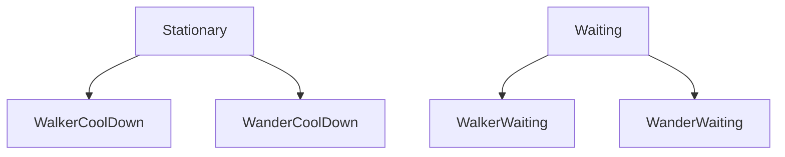
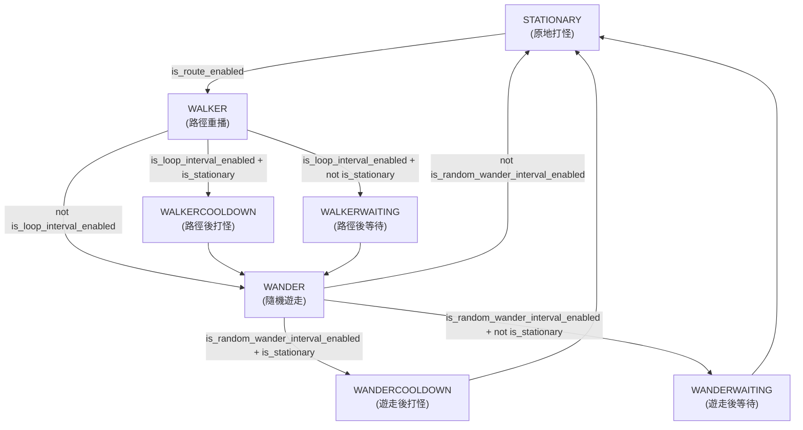
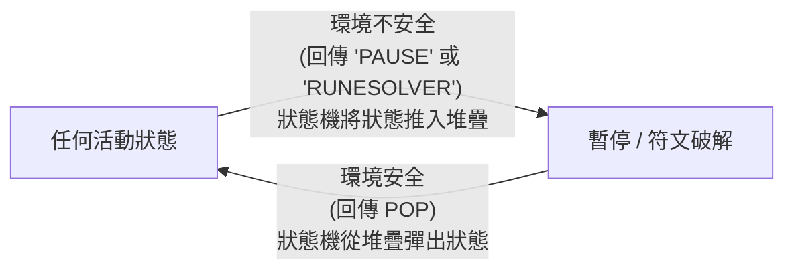

# MapleScript 狀態機文件 (MapleScript State Machine Documentation)

本目錄包含將 MapleGrind 腳本重構為有限狀態機 (Finite State Machine, FSM) 的程式碼。FSM 設計將原有的程序化邏輯解耦，將自動打怪 (grinding)、行走 (walking)、遊走 (wandering)、解符文 (rune solving) 和暫停 (pausing) 等行為隔離到專用的狀態類別中。這提高了專案的可維護性和擴展性。

---

## 🏗️ 架構與核心組件

FSM 系統由三個主要部分組成：

1. **狀態基類 ([States](src/states/base.py))**
   所有具體狀態的父類別。為了防止循環導入 (circular imports)，其型別註解依賴於低階的 `MapleScript` 基類，而不是具體的 `MapleGrind` 類別。此處也定義了堆疊中斷機制所使用的 `POP` 標記物件。

2. **狀態機管理器 ([Machine](src/MapleMachine.py))**
   維護當前活動狀態 (`current_state`)，執行 `switch()` 中的轉換邏輯，管理中斷堆疊 (`stack`)，並驅動 `run()` 中的主執行迴圈。

3. **具體狀態 (Concrete States)**
   實現特定的行為和轉換檢查：
   - **[Stationary](src/states/stationary.py)**：原地打怪行為。每個 tick 執行 `grind_mode()`。
   - **[Waiting](src/states/waiting.py)**：純冷卻等待行為。每個 tick 進入休眠而不進行打怪。接受 `seconds` 和 `next_state` 參數。
   - **[Walker](src/states/walker.py)**：重播錄製的路徑事件。
   - **[Wander](src/states/wander.py)**：隨機向左或向右遊走。
   - **[RuneSolver](src/states/runesolver.py)**：自動移動至符文處並進行破解。
   - **[Pause](src/states/pause.py)**：當遊戲失去焦點、其他玩家出現或符文需要手動處理時停止執行。

---

## 🔄 狀態轉換與冷卻設計

系統使用 **字串識別碼** 進行狀態轉換。每個狀態的 `check_status()` 回傳一個字串鍵值（例如 `"WALKER"`），而不是直接導入並實例化其他狀態類別。`Machine` 透過 `state_mapping` 將字串解析為正確的類別。這避免了狀態模組之間的循環導入。

### 冷卻狀態

在 `Walker` 和 `Wander` 完成工作後，可能會進入一段冷卻期。使用者在冷卻期間是否打怪取決於 `is_stationary` 設定，因此每個冷卻插槽有兩種變體：

| 狀態 | 父類別 | 行為 | 持續時間 | 下一個狀態 |
|---|---|---|---|---|
| `WalkerCoolDown` | `Stationary` | 冷卻期間原地打怪 | `route_interval_seconds` | `WANDER` |
| `WalkerWaiting` | `Waiting` | 冷卻期間閒置等待 | `route_interval_seconds` | `WANDER` |
| `WanderCoolDown` | `Stationary` | 冷卻期間原地打怪 | `random_wander_interval_seconds` | `STATIONARY` |
| `WanderWaiting` | `Waiting` | 冷卻期間閒置等待 | `random_wander_interval_seconds` | `STATIONARY` |

進入哪個冷卻狀態的決定是在 `Walker.check_status()` 和 `Wander.check_status()` 中做出的：

```
is_loop_interval_enabled + is_stationary     → WALKERCOOLDOWN
is_loop_interval_enabled + not is_stationary → WALKERWAITING
```

### 類別繼承



### 正常運作轉換流程



---

## ⏸️ 基於堆疊的中斷機制

當系統偵測到不安全的環境或需要破解的符文時，狀態機會將當前狀態推入堆疊並切換到中斷狀態。這允許在解決中斷後無縫恢復。

有兩個狀態會觸發堆疊推入：`"PAUSE"` 和 `"RUNESOLVER"`。

### 工作原理

1. **觸發中斷**：狀態的 `check_status()` 回傳 `"PAUSE"` 或 `"RUNESOLVER"`。
2. **狀態機推入**：`Machine.switch()` 將當前狀態物件（包括任何內部狀態，如剩餘冷卻時間）推入 `self.stack`，對其調用 `exit()`，然後轉換到中斷狀態。
3. **中斷解決**：一旦環境安全，`Pause.check_status()` 或 `RuneSolver.check_status()` 回傳 `POP` 標記。
4. **狀態機彈出**：`Machine.switch()` 從堆疊中彈出之前的狀態物件並恢復執行 —— 保留中斷前的位置。




---

## 🛠️ 優雅停機

當腳本透過 GUI 停止時，`bot.should_continue()` 會回傳 `False`。

`Machine.switch()` 和 `Machine.run()` 都會檢查此信號：
1. `switch()` 偵測到停機，對當前狀態調用 `exit()` 以釋放任何按住的按鍵，然後回傳 `False`。
2. `run()` 迴圈條件立即失效，防止進一步執行 `execute()`，並確保乾淨俐落的停止。
