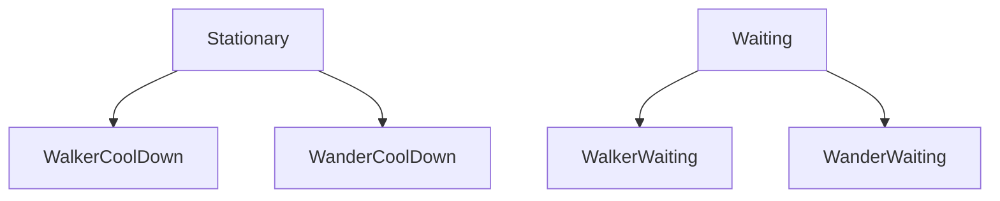
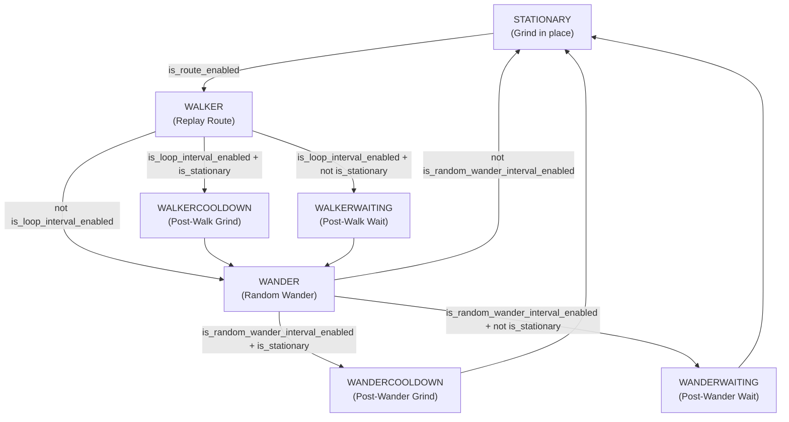
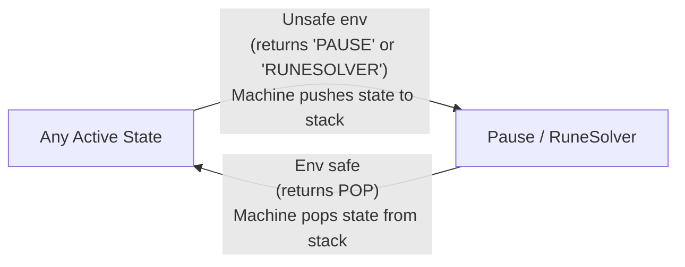

# MapleScript State Machine Documentation

This directory contains the code for the MapleGrind script refactored into a Finite State Machine (FSM). The FSM design decouples the original procedural logic by isolating behaviors like grinding, walking, wandering, rune solving, and pausing into dedicated state classes. This improves the maintainability and scalability of the project.

---

## 🏗️ Architecture & Core Components

The FSM system consists of three main parts:

1. **State Base Class ([States](src/states/base.py))**
   The parent class of all concrete states. To prevent circular imports, its type annotation depends on the low-level `MapleScript` base class rather than the concrete `MapleGrind` class. This also defines the `POP` sentinel object used by the stack-based interrupt mechanism.

2. **State Machine Manager ([Machine](src/MapleMachine.py))**
   Maintains the active state (`current_state`), runs the transition logic in `switch()`, manages the interrupt stack (`stack`), and drives the main execution loop in `run()`.

3. **Concrete States**
   Implement specific behaviors and transition checks:
   - **[Stationary](src/states/stationary.py)**: Stationary grinding behavior. Executes `grind_mode()` every tick.
   - **[Waiting](src/states/waiting.py)**: Pure cooldown waiting behavior. Sleeps every tick without grinding. Accepts `seconds` and `next_state` parameters.
   - **[Walker](src/states/walker.py)**: Replays the recorded route events.
   - **[Wander](src/states/wander.py)**: Randomly wanders left and right.
   - **[RuneSolver](src/states/runesolver.py)**: Moves to and solves map runes automatically.
   - **[Pause](src/states/pause.py)**: Halts execution when the game loses focus, other players appear, or a rune requires manual handling.

---

## 🔄 State Transitions & Cooldown Design

The system uses **string identifiers** for state transitions. Each state's `check_status()` returns a string key (e.g. `"WALKER"`) rather than importing and instantiating other state classes directly. The `Machine` resolves the string to the correct class via `state_mapping`. This avoids circular imports between state modules.

### Cooldown States

After `Walker` and `Wander` complete their work, a cooldown period may begin. Whether the user grinds during cooldown depends on the `is_stationary` setting, so each cooldown slot has two variants:

| State | Parent | Behavior | Duration | Next |
|---|---|---|---|---|
| `WalkerCoolDown` | `Stationary` | Grinds in place during cooldown | `route_interval_seconds` | `WANDER` |
| `WalkerWaiting` | `Waiting` | Waits idly during cooldown | `route_interval_seconds` | `WANDER` |
| `WanderCoolDown` | `Stationary` | Grinds in place during cooldown | `random_wander_interval_seconds` | `STATIONARY` |
| `WanderWaiting` | `Waiting` | Waits idly during cooldown | `random_wander_interval_seconds` | `STATIONARY` |

The decision of which cooldown state to enter is made in `Walker.check_status()` and `Wander.check_status()`:

```
is_loop_interval_enabled + is_stationary     → WALKERCOOLDOWN
is_loop_interval_enabled + not is_stationary → WALKERWAITING
```

### Class Inheritance



### Normal Operation Transition Flow



---

## ⏸️ Stack-based Interrupt Mechanism

When the system detects an unsafe environment or a rune that needs solving, the state machine pushes the current state onto a stack and switches to an interrupt state. This allows seamless resumption after the interruption is resolved.

Two states trigger a stack push: `"PAUSE"` and `"RUNESOLVER"`.

### How it works

1. **Interrupt triggered**: A state's `check_status()` returns `"PAUSE"` or `"RUNESOLVER"`.
2. **Machine pushes**: `Machine.switch()` pushes the current state object (including any internal state such as remaining cooldown time) onto `self.stack`, calls `exit()` on it, then transitions to the interrupt state.
3. **Interrupt resolves**: Once conditions are safe, `Pause.check_status()` or `RuneSolver.check_status()` returns the `POP` sentinel.
4. **Machine pops**: `Machine.switch()` pops the previous state object off the stack and resumes execution — preserving where it left off.




---

## 🛠️ Graceful Shutdown

When the script is stopped via the GUI, `bot.should_continue()` returns `False`.

Both `Machine.switch()` and `Machine.run()` check this signal:
1. `switch()` detects the shutdown, calls `exit()` on the current state to release any held keys, then returns `False`.
2. The `run()` loop condition fails immediately, preventing any further `execute()` calls and ensuring a clean stop.